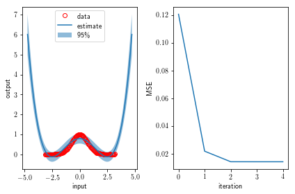
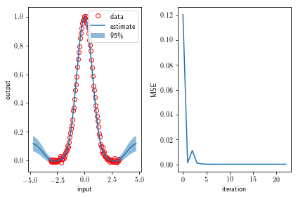
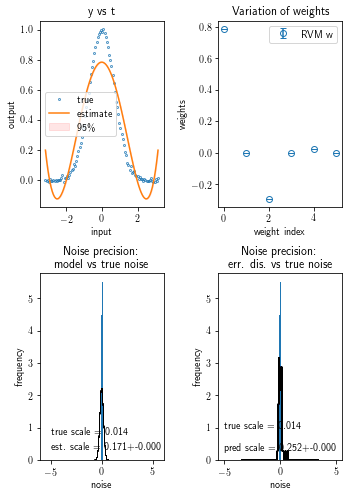
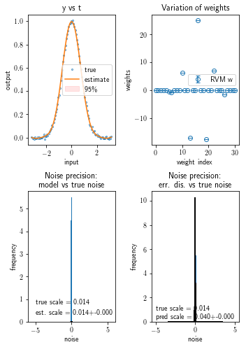

[](https://travis-ci.org/Hamstard/RVMs)

# Tutorial on RVM Regression 

In this tutorial we play around with linear regression in form of Relevance Vector Machines (RVMs) using linear and localized kernels. And heeeere we go!


```python
%matplotlib inline
from linear_model import RelevanceVectorMachine, distribution_wrapper, GaussianFeatures, \
    FourierFeatures, repeated_regression, plot_summary
from sklearn import preprocessing
import numpy as np
from scipy import stats
import matplotlib
import matplotlib.pylab as plt

matplotlib.rc('text', usetex=True)
matplotlib.rcParams['text.latex.preamble']=[r"\usepackage{amsmath}"]
```

First things first, let's set up up the database to regress.


```python
x = np.linspace(-np.pi,np.pi,100)
x_pred = np.linspace(-1.5*np.pi,1.5*np.pi,200)
epsilon = stats.norm(loc=0,scale=0.01)
noise = epsilon.rvs(size=x.shape[0])
t = np.exp(-x**2) + noise

fig = plt.figure(figsize=(5,5))
plt.plot(x,t,'ro',markerfacecolor="None",label="data")
plt.xlabel("input")
plt.ylabel("output")
plt.legend(loc=0)
plt.show()
```


## 1. Single Regression

### 1.1 Linear Kernel

Neat now let's test whether we can regress that data using a polynomial feature space.


```python
# choosing the feature space
k = 5
trafo = preprocessing.PolynomialFeatures(k)
X = trafo.fit_transform(x.reshape((-1,1)))

# initializing hyperparameters
init_beta = 1./ np.var(t) # (that's the default start)
init_alphas = np.ones(X.shape[1])
init_alphas[1:] = np.inf

# setting up the model regression class
model = RelevanceVectorMachine(n_iter=250,verbose=False,compute_score=True,init_beta=init_beta,
                               init_alphas=init_alphas)
# regress
model.fit(X,t)

# predict
X_pred = trafo.fit_transform(x_pred.reshape((-1,1)))
y, yerr = model.predict(X_pred,return_std=True)

fig = plt.figure()
ax = fig.add_subplot(121)
ax.plot(x,t,'ro',label="data",markerfacecolor="None")
ax.fill_between(x_pred,y-2*yerr,y+2*yerr,alpha=.5,label="95\%")
ax.plot(x_pred,y,'-',label="estimate")
plt.legend(loc=0)
ax.set_xlabel("input")
ax.set_ylabel("output")

ax1 = fig.add_subplot(122)
ax1.plot(model.mse_,'-')
ax1.set_xlabel("iteration")
ax1.set_ylabel("MSE")
plt.tight_layout()
plt.show()
```





### 1.2 Localized Kernel

Indeed that seemed to work. But what about a Gaussian feature space, will it be able to fit the Gaussian?


```python
# choosing the feature space
trafo = GaussianFeatures(k=30,mu0=-3,dmu=.2)
X = trafo.fit_transform(x.reshape((-1,1)))

# initializing hyperparameters
init_beta = 1./ np.var(t) # (that's the default start)
init_alphas = np.ones(X.shape[1])
init_alphas[1:] = np.inf

# setting up the model regression class
model = RelevanceVectorMachine(n_iter=250,verbose=False,compute_score=True,init_beta=init_beta,
                               init_alphas=init_alphas)
# regress
model.fit(X,t)

# predict
X_pred = trafo.fit_transform(x_pred.reshape((-1,1)))
y, yerr = model.predict(X_pred,return_std=True)

fig = plt.figure()
ax = fig.add_subplot(121)
ax.plot(x,t,'ro',label="data",markerfacecolor="None")
ax.fill_between(x_pred,y-2*yerr,y+2*yerr,alpha=.5,label="95\%")
ax.plot(x_pred,y,'-',label="estimate")
plt.legend(loc=0)
ax.set_xlabel("input")
ax.set_ylabel("output")

ax1 = fig.add_subplot(122)
ax1.plot(model.mse_,'-')
ax1.set_xlabel("iteration")
ax1.set_ylabel("MSE")
plt.tight_layout()
plt.show()
```





## 2. Repeated Regressions

Indeed using a Gaussian basis set, for some mysterious reason, gave a closer estimate to the real data with tighter confidence intervals. Now let's do the same again for both kernels but multiple times initializing the hyperparmaeters such that we sample them from distributions as well.

### 2.1 Linear Kernel


```python
# choosing the feature space
k = 5
trafo = preprocessing.PolynomialFeatures(k)
X = trafo.fit_transform(x.reshape((-1,1)))
base_trafo = trafo.fit_transform

# initializing hyperparameters using callable distributions giving new hyperparameters
# with every call (useful for repeated regression)
init_beta = distribution_wrapper(stats.halfnorm(scale=1),size=1,single=True)
init_alphas = distribution_wrapper(stats.halfnorm(scale=1),single=False)

model_type = RelevanceVectorMachine
model_kwargs = dict(n_iter=250,verbose=False,compute_score=True,init_beta=init_beta,
                       init_alphas=init_alphas,fit_intercept=False)

Nruns = 100
runtimes, coefs, models = repeated_regression(x,base_trafo,model_type,t=t,
                                              model_kwargs=model_kwargs,Nruns=Nruns,
                                              return_coefs=True,return_models=True)
plot_summary(models,noise,x,t,X,coefs,base_trafo)
```





    
    ================================================
    X = (100, 5) & Nruns = 100:
    ---------------------------
    
    time: estimate = 0.8253s, 2*std = 0.1833s
    
    coefs (estimate +- 2*std):
        0: 0.0000 +- 0.0000
        1: 0.0100 +- 0.1997
        2: 0.0000 +- 0.0000
        3: 0.0000 +- 0.0000
        4: 1.2429 +- 0.0485
    
    ================================================
    X = (100, 9) & Nruns = 100:
    ---------------------------
    
    time: estimate = 0.8362s, 2*std = 0.0503s
    
    coefs (estimate +- 2*std):
        0: 0.0000 +- 0.0000
        1: 0.0000 +- 0.0000
        2: 0.0000 +- 0.0000
        3: 0.0000 +- 0.0000
        4: 0.0000 +- 0.0000
        5: 0.0000 +- 0.0000
        6: 0.0000 +- 0.0000
        7: 0.0000 +- 0.0000
        8: 0.0000 +- 0.0000
    
    ================================================
    X = (100, 19) & Nruns = 100:
    ----------------------------
    
    time: estimate = 0.8444s, 2*std = 0.0889s
    
    coefs (estimate +- 2*std):
        0: 0.0000 +- 0.0000
        1: 0.0000 +- 0.0000
        2: 0.0000 +- 0.0000
        3: 0.0000 +- 0.0000
        4: 0.0000 +- 0.0000
        5: 0.0000 +- 0.0000
        6: 0.0000 +- 0.0000
        7: 0.0000 +- 0.0000
        8: 0.0000 +- 0.0000
        9: 0.0000 +- 0.0000
        10: 0.0000 +- 0.0000
        11: 0.0000 +- 0.0000
        12: 0.0000 +- 0.0000
        13: 0.0000 +- 0.0000
        14: 0.0000 +- 0.0000
        15: 0.0000 +- 0.0000
        16: 0.0000 +- 0.0000
        17: 0.0000 +- 0.0000
        18: 0.0000 +- 0.0000
    
    ================================================
    X = (100, 39) & Nruns = 100:
    ----------------------------
    
    time: estimate = 0.8661s, 2*std = 0.0410s
    
    coefs (estimate +- 2*std):
        0: 0.0000 +- 0.0000
        1: 0.0000 +- 0.0000
        2: 0.0000 +- 0.0000
        3: 0.0000 +- 0.0000
        4: 0.0000 +- 0.0000
        5: 0.0000 +- 0.0000
        6: 0.0000 +- 0.0000
        7: 0.0000 +- 0.0000
        8: 0.0000 +- 0.0000
        9: 0.0000 +- 0.0000
        10: 0.0000 +- 0.0000
        11: 0.0000 +- 0.0000
        12: 0.0000 +- 0.0000
        13: 0.0000 +- 0.0000
        14: 0.0000 +- 0.0000
        15: 0.0000 +- 0.0000
        16: 0.0000 +- 0.0000
        17: 0.0000 +- 0.0000
        18: 0.0000 +- 0.0000
        19: 0.0000 +- 0.0000
        20: 0.0000 +- 0.0000
        21: 0.0000 +- 0.0000
        22: 0.0000 +- 0.0000
        23: 0.0000 +- 0.0000
        24: 0.0000 +- 0.0000
        25: 0.0000 +- 0.0000
        26: 0.0000 +- 0.0000
        27: 0.0000 +- 0.0000
        28: 0.0000 +- 0.0000
        29: 0.0000 +- 0.0000
        30: 0.0000 +- 0.0000
        31: 0.0000 +- 0.0000
        32: 0.0000 +- 0.0000
        33: 0.0000 +- 0.0000
        34: 0.0000 +- 0.0000
        35: 0.0000 +- 0.0000
        36: 0.0000 +- 0.0000
        37: 0.0000 +- 0.0000
        38: 0.0000 +- 0.0000
    
    ================================================
    X = (100, 99) & Nruns = 100:
    ----------------------------
    
    time: estimate = 0.9064s, 2*std = 0.0397s
    
    coefs (estimate +- 2*std):
        0: 0.0000 +- 0.0000
        1: 0.0000 +- 0.0000
        2: 0.0000 +- 0.0000
        3: 0.0000 +- 0.0000
        4: 0.0000 +- 0.0000
        5: 0.0000 +- 0.0000
        6: 0.0000 +- 0.0000
        7: 0.0000 +- 0.0000
        8: 0.0000 +- 0.0000
        9: 0.0000 +- 0.0000
        10: 0.0000 +- 0.0000
        11: 0.0000 +- 0.0000
        12: 0.0000 +- 0.0000
        13: 0.0000 +- 0.0000
        14: 0.0000 +- 0.0000
        15: 0.0000 +- 0.0000
        16: 0.0000 +- 0.0000
        17: 0.0000 +- 0.0000
        18: 0.0000 +- 0.0000
        19: 0.0000 +- 0.0000
        20: 0.0000 +- 0.0000
        21: 0.0000 +- 0.0000
        22: 0.0000 +- 0.0000
        23: 0.0000 +- 0.0000
        24: 0.0000 +- 0.0000
        25: 0.0000 +- 0.0000
        26: 0.0000 +- 0.0000
        27: 0.0000 +- 0.0000
        28: 0.0000 +- 0.0000
        29: 0.0000 +- 0.0000
        30: 0.0000 +- 0.0000
        31: 0.0000 +- 0.0000
        32: 0.0000 +- 0.0000
        33: 0.0000 +- 0.0000
        34: 0.0000 +- 0.0000
        35: 0.0000 +- 0.0000
        36: 0.0000 +- 0.0000
        37: 0.0000 +- 0.0000
        38: 0.0000 +- 0.0000
        39: 0.0000 +- 0.0000
        40: 0.0000 +- 0.0000
        41: 0.0000 +- 0.0000
        42: 0.0000 +- 0.0000
        43: 0.0000 +- 0.0000
        44: 0.0000 +- 0.0000
        45: 0.0000 +- 0.0000
        46: 0.0000 +- 0.0000
        47: 0.0000 +- 0.0000
        48: 0.0000 +- 0.0000
        49: 0.0000 +- 0.0000
        50: 0.0000 +- 0.0000
        51: 0.0000 +- 0.0000
        52: 0.0000 +- 0.0000
        53: 0.0000 +- 0.0000
        54: 0.0000 +- 0.0000
        55: 0.0000 +- 0.0000
        56: 0.0000 +- 0.0000
        57: 0.0000 +- 0.0000
        58: 0.0000 +- 0.0000
        59: 0.0000 +- 0.0000
        60: 0.0000 +- 0.0000
        61: 0.0000 +- 0.0000
        62: 0.0000 +- 0.0000
        63: 0.0000 +- 0.0000
        64: 0.0000 +- 0.0000
        65: 0.0000 +- 0.0000
        66: 0.0000 +- 0.0000
        67: 0.0000 +- 0.0000
        68: 0.0000 +- 0.0000
        69: 0.0000 +- 0.0000
        70: 0.0000 +- 0.0000
        71: 0.0000 +- 0.0000
        72: 0.0000 +- 0.0000
        73: 0.0000 +- 0.0000
        74: 0.0000 +- 0.0000
        75: 0.0000 +- 0.0000
        76: 0.0000 +- 0.0000
        77: 0.0000 +- 0.0000
        78: 0.0000 +- 0.0000
        79: 0.0000 +- 0.0000
        80: 0.0000 +- 0.0000
        81: 0.0000 +- 0.0000
        82: 0.0000 +- 0.0000
        83: 0.0000 +- 0.0000
        84: 0.0000 +- 0.0000
        85: 0.0000 +- 0.0000
        86: 0.0000 +- 0.0000
        87: 0.0000 +- 0.0000
        88: 0.0000 +- 0.0000
        89: 0.0000 +- 0.0000
        90: 0.0000 +- 0.0000
        91: 0.0000 +- 0.0000
        92: 0.0000 +- 0.0000
        93: 0.0000 +- 0.0000
        94: 0.0000 +- 0.0000
        95: 0.0000 +- 0.0000
        96: 0.0000 +- 0.0000
        97: 0.0000 +- 0.0000
        98: 0.0000 +- 0.0000
    

### 2.2 Localized kernel


```python
# choosing the feature space
trafo = GaussianFeatures(k=30,mu0=-3,dmu=.2)
base_trafo = trafo.fit_transform

# initializing hyperparameters using callable distributions giving new hyperparameters
# with every call (useful for repeated regression)
init_beta = distribution_wrapper(stats.halfnorm(scale=1),size=1,single=True)
init_alphas = distribution_wrapper(stats.halfnorm(scale=1),single=False)

model_type = RelevanceVectorMachine
model_kwargs = dict(n_iter=250,verbose=False,compute_score=True,init_beta=init_beta,
                       init_alphas=init_alphas,fit_intercept=False)

Nruns = 100
runtimes, coefs, models = repeated_regression(x,base_trafo,model_type,t=t,
                                              model_kwargs=model_kwargs,Nruns=Nruns,
                                              return_coefs=True,return_models=True)
X = base_trafo(x.reshape((-1,1)))
plot_summary(models,noise,x,t,X,coefs,base_trafo)
```





    
    ================================================
    X = (100, 5) & Nruns = 100:
    ---------------------------
    
    time: estimate = 1.6959s, 2*std = 0.1946s
    
    coefs (estimate +- 2*std):
        0: 0.0000 +- 0.0000
        1: 0.0000 +- 0.0000
        2: 0.0000 +- 0.0000
        3: 0.0000 +- 0.0000
        4: 1.2442 +- 0.0000
    
    ================================================
    X = (100, 9) & Nruns = 100:
    ---------------------------
    
    time: estimate = 1.7593s, 2*std = 0.3068s
    
    coefs (estimate +- 2*std):
        0: 0.0000 +- 0.0000
        1: 0.0000 +- 0.0000
        2: 0.0000 +- 0.0000
        3: 0.0000 +- 0.0000
        4: 0.0000 +- 0.0000
        5: 0.0000 +- 0.0000
        6: 0.0000 +- 0.0000
        7: 0.0000 +- 0.0000
        8: 0.0000 +- 0.0000
    
    ================================================
    X = (100, 19) & Nruns = 100:
    ----------------------------
    
    time: estimate = 1.9069s, 2*std = 0.3845s
    
    coefs (estimate +- 2*std):
        0: 0.0000 +- 0.0000
        1: 0.0000 +- 0.0000
        2: 0.0000 +- 0.0000
        3: 0.0000 +- 0.0000
        4: 0.0000 +- 0.0000
        5: 0.0000 +- 0.0000
        6: 0.0000 +- 0.0000
        7: 0.0000 +- 0.0000
        8: 0.0000 +- 0.0000
        9: 0.0000 +- 0.0000
        10: 0.0000 +- 0.0000
        11: 0.0000 +- 0.0000
        12: 0.0000 +- 0.0000
        13: 0.0000 +- 0.0000
        14: 0.0000 +- 0.0000
        15: 0.0000 +- 0.0000
        16: 0.0000 +- 0.0000
        17: 0.0000 +- 0.0000
        18: 0.0000 +- 0.0000
    
    ================================================
    X = (100, 39) & Nruns = 100:
    ----------------------------
    
    time: estimate = 1.9138s, 2*std = 0.3726s
    
    coefs (estimate +- 2*std):
        0: 0.0000 +- 0.0000
        1: 0.0000 +- 0.0000
        2: 0.0000 +- 0.0000
        3: 0.0000 +- 0.0000
        4: 0.0000 +- 0.0000
        5: 0.0000 +- 0.0000
        6: 0.0000 +- 0.0000
        7: 0.0000 +- 0.0000
        8: 0.0000 +- 0.0000
        9: 0.0000 +- 0.0000
        10: 0.0000 +- 0.0000
        11: 0.0000 +- 0.0000
        12: 0.0000 +- 0.0000
        13: 0.0000 +- 0.0000
        14: 0.0000 +- 0.0000
        15: 0.0000 +- 0.0000
        16: 0.0000 +- 0.0000
        17: 0.0000 +- 0.0000
        18: 0.0000 +- 0.0000
        19: 0.0000 +- 0.0000
        20: 0.0000 +- 0.0000
        21: 0.0000 +- 0.0000
        22: 0.0000 +- 0.0000
        23: 0.0000 +- 0.0000
        24: 0.0000 +- 0.0000
        25: 0.0000 +- 0.0000
        26: 0.0000 +- 0.0000
        27: 0.0000 +- 0.0000
        28: 0.0000 +- 0.0000
        29: 0.0000 +- 0.0000
        30: 0.0000 +- 0.0000
        31: 0.0000 +- 0.0000
        32: 0.0000 +- 0.0000
        33: 0.0000 +- 0.0000
        34: 0.0000 +- 0.0000
        35: 0.0000 +- 0.0000
        36: 0.0000 +- 0.0000
        37: 0.0000 +- 0.0000
        38: 0.0000 +- 0.0000
    
    ================================================
    X = (100, 99) & Nruns = 100:
    ----------------------------
    
    time: estimate = 2.0383s, 2*std = 0.2625s
    
    coefs (estimate +- 2*std):
        0: 0.0000 +- 0.0000
        1: 0.0000 +- 0.0000
        2: 0.0000 +- 0.0000
        3: 0.0000 +- 0.0000
        4: 0.0000 +- 0.0000
        5: 0.0000 +- 0.0000
        6: 0.0000 +- 0.0000
        7: 0.0000 +- 0.0000
        8: 0.0000 +- 0.0000
        9: 0.0000 +- 0.0000
        10: 0.0000 +- 0.0000
        11: 0.0000 +- 0.0000
        12: 0.0000 +- 0.0000
        13: 0.0000 +- 0.0000
        14: 0.0000 +- 0.0000
        15: 0.0000 +- 0.0000
        16: 0.0000 +- 0.0000
        17: 0.0000 +- 0.0000
        18: 0.0000 +- 0.0000
        19: 0.0000 +- 0.0000
        20: 0.0000 +- 0.0000
        21: 0.0000 +- 0.0000
        22: 0.0000 +- 0.0000
        23: 0.0000 +- 0.0000
        24: 0.0000 +- 0.0000
        25: 0.0000 +- 0.0000
        26: 0.0000 +- 0.0000
        27: 0.0000 +- 0.0000
        28: 0.0000 +- 0.0000
        29: 0.0000 +- 0.0000
        30: 0.0000 +- 0.0000
        31: 0.0000 +- 0.0000
        32: 0.0000 +- 0.0000
        33: 0.0000 +- 0.0000
        34: 0.0000 +- 0.0000
        35: 0.0000 +- 0.0000
        36: 0.0000 +- 0.0000
        37: 0.0000 +- 0.0000
        38: 0.0000 +- 0.0000
        39: 0.0000 +- 0.0000
        40: 0.0000 +- 0.0000
        41: 0.0000 +- 0.0000
        42: 0.0000 +- 0.0000
        43: 0.0000 +- 0.0000
        44: 0.0000 +- 0.0000
        45: 0.0000 +- 0.0000
        46: 0.0000 +- 0.0000
        47: 0.0000 +- 0.0000
        48: 0.0000 +- 0.0000
        49: 0.0000 +- 0.0000
        50: 0.0000 +- 0.0000
        51: 0.0000 +- 0.0000
        52: 0.0000 +- 0.0000
        53: 0.0000 +- 0.0000
        54: 0.0000 +- 0.0000
        55: 0.0000 +- 0.0000
        56: 0.0000 +- 0.0000
        57: 0.0000 +- 0.0000
        58: 0.0000 +- 0.0000
        59: 0.0000 +- 0.0000
        60: 0.0000 +- 0.0000
        61: 0.0000 +- 0.0000
        62: 0.0000 +- 0.0000
        63: 0.0000 +- 0.0000
        64: 0.0000 +- 0.0000
        65: 0.0000 +- 0.0000
        66: 0.0000 +- 0.0000
        67: 0.0000 +- 0.0000
        68: 0.0000 +- 0.0000
        69: 0.0000 +- 0.0000
        70: 0.0000 +- 0.0000
        71: 0.0000 +- 0.0000
        72: 0.0000 +- 0.0000
        73: 0.0000 +- 0.0000
        74: 0.0000 +- 0.0000
        75: 0.0000 +- 0.0000
        76: 0.0000 +- 0.0000
        77: 0.0000 +- 0.0000
        78: 0.0000 +- 0.0000
        79: 0.0000 +- 0.0000
        80: 0.0000 +- 0.0000
        81: 0.0000 +- 0.0000
        82: 0.0000 +- 0.0000
        83: 0.0000 +- 0.0000
        84: 0.0000 +- 0.0000
        85: 0.0000 +- 0.0000
        86: 0.0000 +- 0.0000
        87: 0.0000 +- 0.0000
        88: 0.0000 +- 0.0000
        89: 0.0000 +- 0.0000
        90: 0.0000 +- 0.0000
        91: 0.0000 +- 0.0000
        92: 0.0000 +- 0.0000
        93: 0.0000 +- 0.0000
        94: 0.0000 +- 0.0000
        95: 0.0000 +- 0.0000
        96: 0.0000 +- 0.0000
        97: 0.0000 +- 0.0000
        98: 0.0000 +- 0.0000
    

Excellent, that seemed to work and the Gaussians in the basis set near the true Gaussian in our data also seemed to receive the largest weights. Neat!
